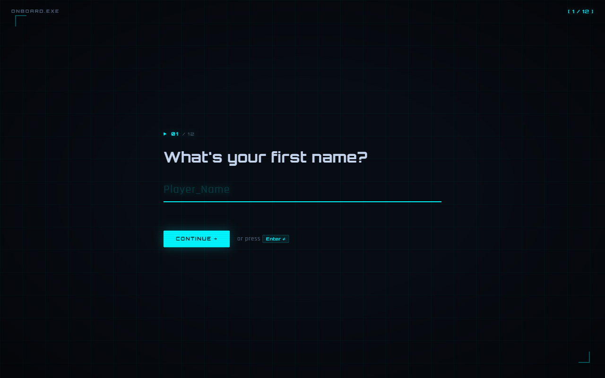
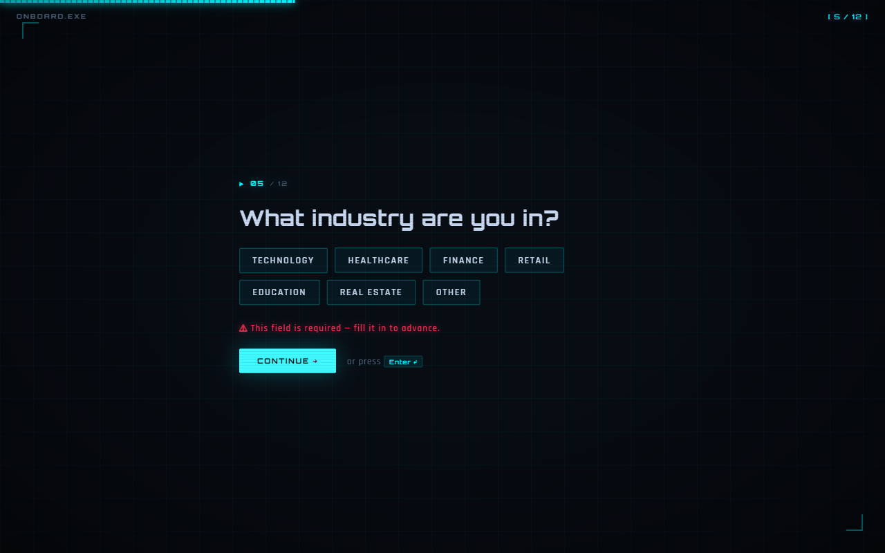
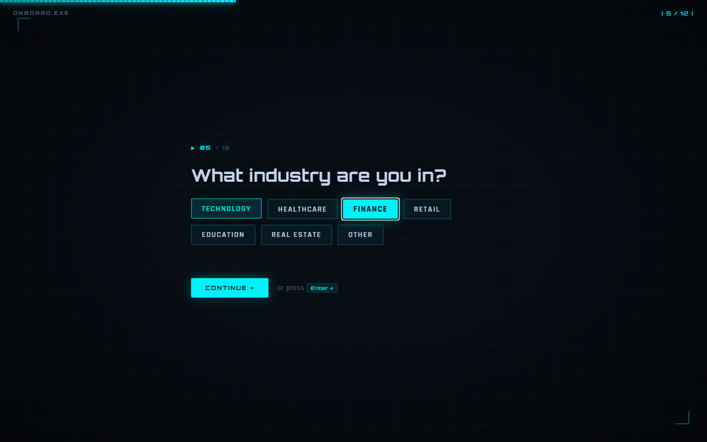
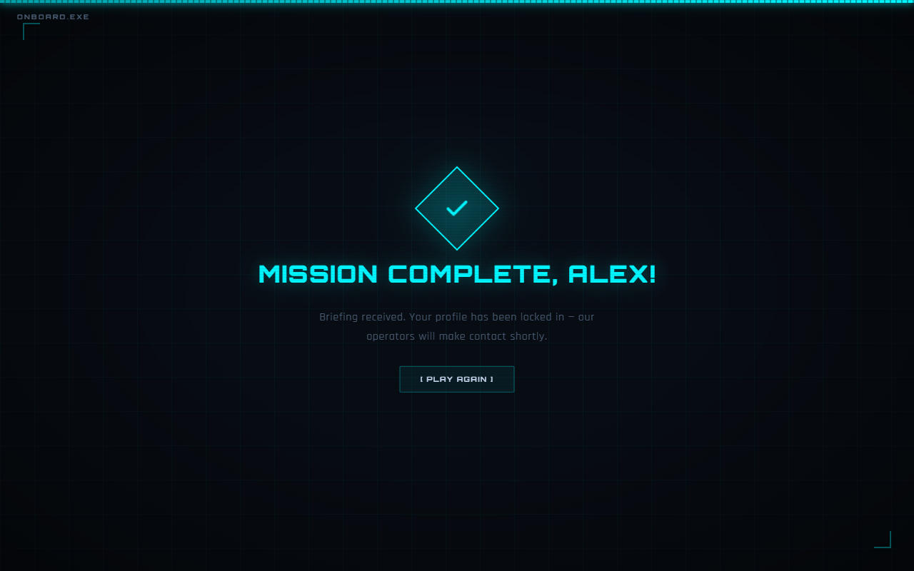
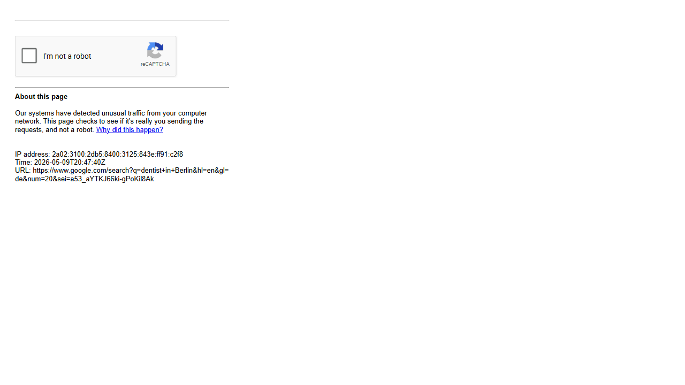
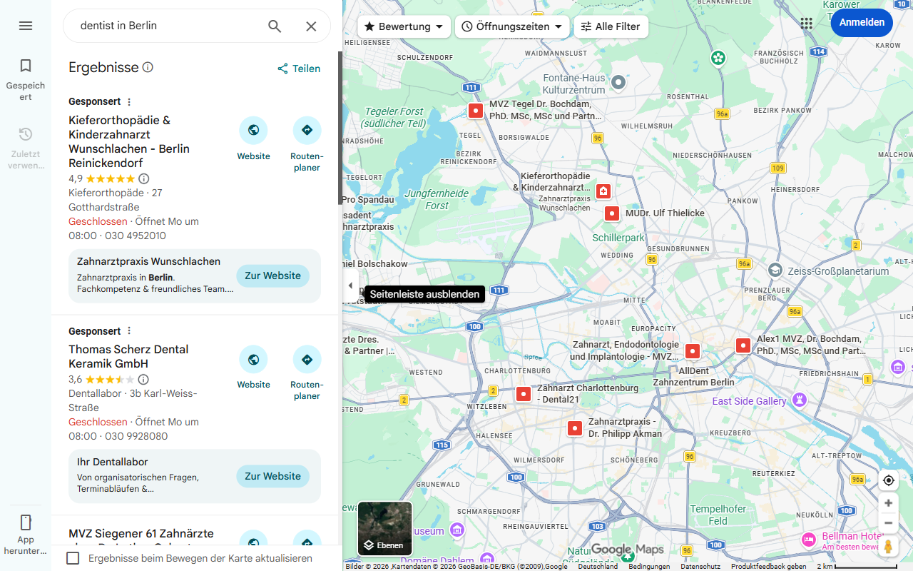
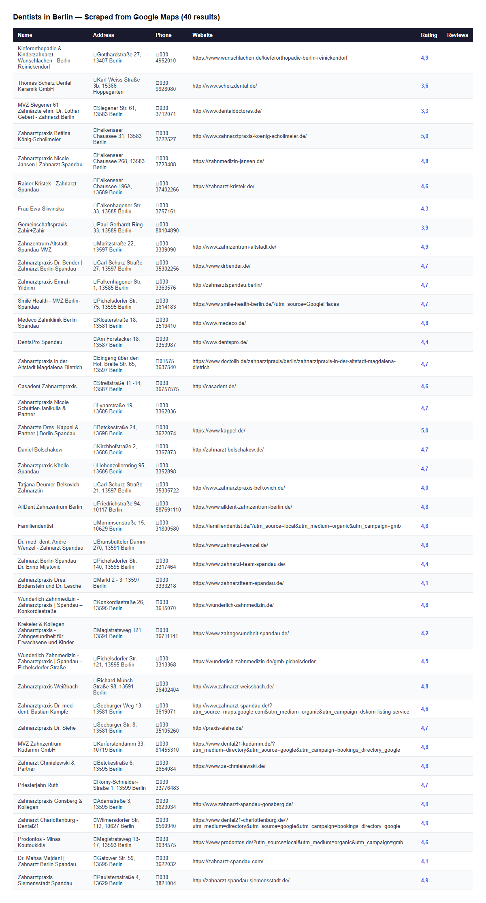

# Browser Automation Demo

A hands-on project for automating real browsers using **Playwright** and **TypeScript**.  
It can take screenshots, fill out forms, scrape public data, and run automated tests — all from the command line.

---

## What's Inside

| Folder / File | What it does                                     |
| ------------- | ------------------------------------------------ |
| `scripts/`    | One-off automation tasks you run directly        |
| `tests/`      | Automated tests that check things work correctly |
| `public/`     | A sample multi-step web form used for testing    |

---

## How to Set It Up

**Step 1 — Make sure you have Node.js installed**  
Download from [nodejs.org](https://nodejs.org) if you don't have it.

**Step 2 — Clone this repo and open the folder**

```bash
git clone <your-repo-url>
cd browser-automation-demo
```

**Step 3 — Install dependencies**

```bash
npm install
npx playwright install
```

This downloads Playwright and the browsers it controls (Chrome, Firefox, Safari).

---

## What You Can Do

### Take a screenshot of any website

```bash
npm run screenshot https://example.com output.png
```

Opens a headless browser, visits the URL, saves a full-page screenshot.

### Run the demo automation

```bash
npm run demo
```

Opens the Playwright docs site, clicks around, and saves screenshots at each step.

### Scrape dentist contacts from Google Maps

```bash
npx ts-node scripts/dentists-berlin.ts
```

Searches Google Maps for dentists in Berlin, clicks each result, and saves the contact list to:

- `dentists-berlin.json` — structured data
- `dentists-berlin.csv` — open in Excel / Google Sheets

### Serve the sample web form

```bash
npm run serve
```

Starts a local server at `http://localhost:3000` with a 12-question onboarding form.

---

## Screenshots

### Onboarding form automation






---

### Google Maps scraper — dentists in Berlin





---

## How to Run Tests

**Run all tests (Chrome + Firefox + Safari in parallel)**

```bash
npm test
```

**Run with a visible browser window so you can watch**

```bash
npm run test:headed
```

**Open the visual test explorer**

```bash
npm run test:ui
```

**Run just one test file**

```bash
npx playwright test tests/form.spec.ts
```

**Run on one browser only**

```bash
npx playwright test --project=chromium
```

---

## How the Tests Work

The test suite (`tests/form.spec.ts`) automatically:

1. Opens the sample form in a browser
2. Fills in text fields and presses Enter
3. Clicks chip-style answer buttons
4. Checks that the right slide becomes active
5. Completes all 12 questions and verifies the confirmation screen appears

If any step fails, Playwright saves a screenshot and a trace file so you can see exactly what went wrong.

---

## Project Structure

```
browser-automation-demo/
├── scripts/
│   ├── screenshot.ts          # Screenshot any URL
│   ├── demo.ts                # Multi-step navigation demo
│   ├── dentists-berlin.ts     # Google Maps scraper
│   └── serve.ts               # Local dev server
├── tests/
│   ├── example.spec.ts        # Basic Playwright smoke test
│   └── form.spec.ts           # Full onboarding form test suite
├── public/
│   └── index.html             # Sample 12-question onboarding form
├── playwright.config.ts       # Test runner config (3 browsers, HTML report)
├── tsconfig.json              # TypeScript config
└── package.json
```

---

## Tech Stack

- **[Playwright](https://playwright.dev)** — controls real browsers programmatically
- **[TypeScript](https://www.typescriptlang.org)** — typed JavaScript
- **[ts-node](https://typestrong.org/ts-node)** — runs TypeScript files directly without a build step
- **Node.js** — runtime environment

---

## Quick Reference

| Command                    | What it does                   |
| -------------------------- | ------------------------------ |
| `npm test`                 | Run all tests                  |
| `npm run test:headed`      | Run tests with visible browser |
| `npm run test:ui`          | Open visual test runner        |
| `npm run screenshot <url>` | Screenshot a webpage           |
| `npm run demo`             | Run the demo script            |
| `npm run serve`            | Serve the sample form locally  |
| `npm run codegen`          | Record browser actions as code |
